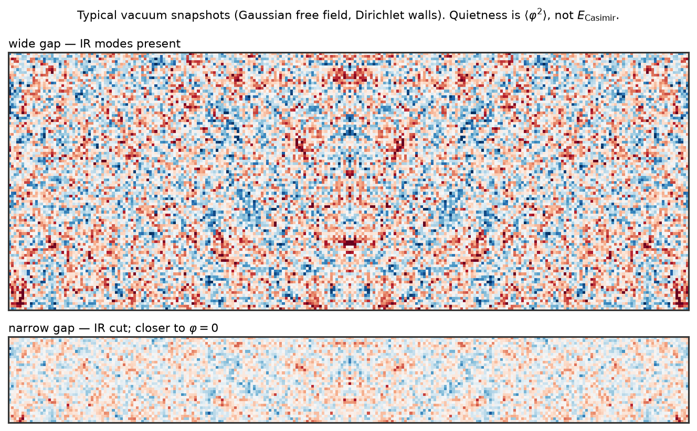
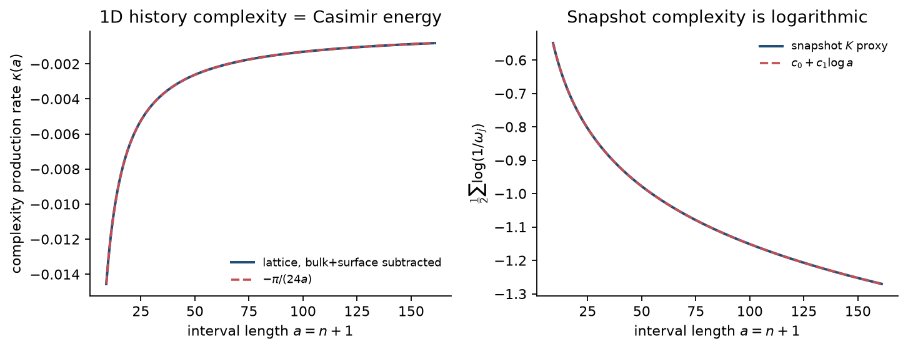
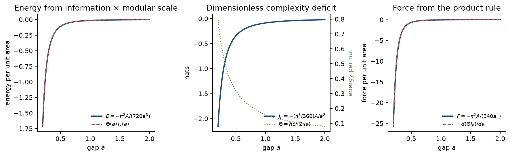

# The Casimir Effect as a Kolmogorov-Complexity Gradient

**Kasimir theory.** A universe whose configurations are weighted by \(2^{-K(\,\cdot\,)}\) — a Gibbs ensemble with Hamiltonian equal to prefix Kolmogorov complexity — reproduces the Casimir force as the variation of vacuum *complexity production* with respect to a boundary constraint. For histories, not snapshots, the typical-set value of that complexity rate *is* the Euclidean effective action. Conducting plates condition the universal prior; the resulting algorithmic free energy is the Casimir energy. The \(1/a^{4}\) law is dimensional analysis on an information deficit supported on the gap: a dimensionless complexity \(\sim A/a^{2}\) times an energy-per-nat \(\sim \hbar c/a\). Exact prefactors are spectral zeta values, read here as regularized complexity moments. The theory is a derivation of the QFT result from a single postulate, plus a short list of corrections that QED does not contain.

---

## Abstract

Assume a single physical postulate: complete field histories \(\varphi\) are distributed according to the Solomonoff–Levin semimeasure \(\mu(\varphi)\propto 2^{-K(\varphi)}\), equivalently a Tadaki–Baez–Stay algorithmic-thermodynamic ensemble with energy identified to prefix complexity \(K\). Restricting to local, Gaussian, Lorentz-invariant typical sets, this measure coincides with the Euclidean path integral of a free field. Material boundaries are conditionings of that measure. The marginal on a slow geometric modulus \(a\) (plate separation) is the constrained partition function, and the algorithmic free energy \(F_K(a)\) equals the Casimir free energy.

In \(1{+}1\) dimensions the renormalised complexity deficit of a Dirichlet interval is the spectral invariant \(1/24\) nat, and the only available conversion scale is \(\hbar\pi c/a\); their product is the exact Casimir energy \(-\hbar\pi c/(24a)\). In \(3{+}1\) dimensions the deficit is an area law \(I_K(a)=-(\pi^{3}/360)\,A/a^{2}\) nats once energy is measured in units of the modular scale \(\hbar c/(2\pi a)\); the product rule \(E=\Theta I_K\) then yields

\[
\frac{E}{A}=-\frac{\pi^{2}\hbar c}{720\,a^{3}}\,,\qquad
\frac{F}{A}=-\frac{\pi^{2}\hbar c}{240\,a^{4}}\,.
\]

Zeta-function and heat-kernel subtractions are reinterpreted as discarding Kolmogorov-local counterterms (short programs that specify bulk and surface Lagrangians). What remains, and what the plates feel, is the nonlocal complexity that knows the global modulus \(a\).

The construction does not replace QED at laboratory precision. It supplies an ontology for the vacuum energy *difference*, explains why that difference is finite when plates move rigidly, and isolates the places where a genuinely algorithmic correction could appear: uncomputable \(O(1)\) terms, algorithmically random versus short-program roughness of equal power spectrum, and the bulk (cosmological-constant) term as a volume-extensive complexity that holography cuts off.

---

## 1. Introduction

Two uncharged conducting plates in vacuum attract. Casimir’s 1948 calculation assigns the force to a deficit of electromagnetic zero-point modes between the plates, and after regularisation one finds the universal pressure

\[
\frac{F}{A}=-\frac{\pi^{2}\hbar c}{240\,a^{4}}
\tag{1}
\]

for perfect reflectors at zero temperature and separation \(a\) [1]. The same number is the \(T\to 0\) limit of Lifshitz theory [2], the van der Waals force of retarded quantum dipoles [3], and the variation of the one-loop Euclidean effective action with respect to the gap [4,5]. Experiment confirms the effect at the percent level [6,7].

None of those derivations says *why the vacuum should care*. Mode sums, Green functions and reflection determinants all presuppose a quantum field whose ground-state energy is \(\sum\tfrac12\hbar\omega_k\). That expression is ultraviolet divergent. The observable force is a finite remainder after subtracting a larger, unobservable bulk. The subtraction works, but it is an answer to a different question than “what is the vacuum trying to do?”

This paper answers from a different primitive. Suppose the universe is not a Hamiltonian system that happens to have a simple Lagrangian, but an ensemble that *prefers simple descriptions*: the probability of a complete configuration is exponentially small in its Kolmogorov complexity. Then:

1. The cheapest typical field histories are Gaussian and local — that is, free Euclidean QFT.
2. A conducting boundary is a constraint, and constraints change the measure on histories.
3. The plates move so as to increase the measure (decrease the typical complexity rate). For parallel perfect conductors, that direction is inward, with the force (1).

The idea that physical probability tracks algorithmic complexity is not new. Solomonoff induction [8], Levin’s universal semimeasure [9], Zurek’s physical entropy [10], Tadaki’s and Baez–Stay’s algorithmic thermodynamics [11,12], and Müller’s “law without law” [13] all treat \(K\) as a physical resource. What is new here is a complete dictionary from that postulate to the Casimir calculation, including the spectral prefactors, a precise statement of *which* complexity is the energy (histories, not snapshots), and an account of why zeta regularisation is the subtraction a low-\(K\) universe would perform.

A parallel observation, in Shannon rather than Kolmogorov language, is that the ideal Casimir pressure can be written as a modular energy times the derivative of a finite mutual-information functional \(I(a)\propto A/a^{2}\) [14]. Section 7 derives the same split, fixes the coefficient from zeta values, and keeps the product rule for \(E=\Theta I\) so that force and energy are thermodynamically consistent.

---

## 2. The low-\(K\) ensemble

**Postulate K.** Let \(U\) be a fixed universal prefix-free Turing machine. For a complete physical record \(x\) (a discretised field history on a finite lattice, at finite precision, for finite Euclidean time), write \(K(x)=\min\{\lvert p\rvert:U(p)=x\}\). The physical measure is the Solomonoff–Levin semimeasure

\[
\mu_U(x)\;=\;\sum_{U(p)=x}2^{-\lvert p\rvert}\,,
\tag{2}
\]

which satisfies \(\mu_U(x)\asymp 2^{-K(x)}\) up to a \(U\)-dependent multiplicative constant (the coding theorem [15, Ch. 4]). Equivalently, programs are a Gibbs ensemble at inverse temperature \(\ln 2\) with energy equal to program length [11,12].

Three immediate comments.

- *Invariance.* Changing \(U\) changes \(K\) by an additive constant independent of \(x\). All forces in this paper are derivatives with respect to a geometric modulus, so the constant drops. The uncomputable, machine-dependent \(O(1)\) is a real remainder; it is negligible for macroscopic plates (Section 11) and is one of the theory’s distinctive corrections.
- *This is not a dynamical law.* Postulate K is a measure on complete records, not a vector field on configuration space that “pulls toward simplicity.” There is no extra force term in the Maxwell equations. The Casimir force will appear as the thermodynamic force conjugate to \(a\) in the marginal of \(\mu_U\).
- *Preference is typical-set preference.* A *particular* high-entropy microstate has *large* \(K\) and is individually suppressed. A macrostate with many such microstates can still dominate. The physically relevant quantity is the measure of a constrained set of histories, i.e. a partition function, not the complexity of one frozen snapshot.

---

## 3. Which complexity?

Kolmogorov complexity is cheap to invoke and easy to point at the wrong object. Four candidates present themselves. Only one reproduces Casimir scaling.

| Object | Scaling with gap \(a\) | Casimir? |
|---|---|---|
| \(K(\text{geometry})\) of the plates | \(K(a)+O(1)\) | no (prefers computable \(a\), not small \(a\)) |
| \(K(\psi_a)\) of the Gaussian vacuum *state* | \(K(a)+O(1)\) | no (the state is a short program: “ground state of the Dirichlet Laplacian”) |
| Typical \(K\) of a *spatial snapshot* \(\varphi(\mathbf{x})\) | \(\tfrac12\mathrm{Tr}\log\Sigma_a\sim\zeta'(0)\sim\log a\) in 1D | no (wrong spectral moment) |
| Typical \(K\) of a Euclidean *history* \(\varphi(\tau,\mathbf{x})\) of duration \(\beta\) | \(\beta\,E_{\mathrm{vac}}(a)/\ln 2\) | **yes** (\(\zeta(-1)\)) |

Typical spatial snapshots *are* quieter in a narrow Dirichlet cavity — the field is closer to the identically-zero configuration, which is the Kolmogorov-simplest field — but that quietness is \(\langle\varphi^{2}\rangle_{\mathrm{ren}}\), the wrong spectral moment for the force.

A Gaussian free field with covariance \(\Sigma\) has typical-sample complexity (Appendix B)

\[
K(\varphi_\delta)\;=\;\tfrac12\log_2\det\!\bigl(2\pi e\,\Sigma/\delta^{2}\bigr)+K(\Sigma)+O(\log N)\,.
\tag{3}
\]

For a collection of oscillators, \(\Sigma_{kk}\propto 1/\omega_k\), so (3) tracks \(\sum\log\omega_k\), the spectral zeta function at \(s=0\), not \(\sum\omega_k\). In one dimension that is logarithmic in \(a\). It is a real physical density (it is essentially \(\langle\varphi^{2}\rangle\) and the functional determinant) and it *is* suppressed between Dirichlet plates — the cavity is quieter — but it is not the energy that the plates feel.

Histories fix the moment. A Euclidean record of duration \(\beta\) is a list of snapshots. For a free field the quadratic action is local in time after Wick rotation, and the Gaussian integral over Matsubara modes converts \(\sum\log(\nu_n^{2}+\omega^{2})\) into \(\sum\omega\) (plus thermal polylogarithms at finite \(\beta\)). Equivalently, Brudno’s theorem [16] identifies the Kolmogorov-complexity *rate* of a typical trajectory of an ergodic system with the Kolmogorov–Sinai entropy rate; the Euclidean QFT analog of that rate is the free-energy density. At zero temperature the free energy is the vacuum energy.

**Definition.** The *complexity production rate* of a constrained vacuum is

\[
\kappa(a)\;:=\;\lim_{\beta\to\infty}\frac{\ln 2}{\beta}\,\mathbb{E}_{\mu}\bigl[K\bigl(\varphi\big|_{[0,\beta]}\bigm|\,C_a\bigr)\bigr]_{\mathrm{ren}}\,,
\tag{4}
\]

where \(C_a\) is the constraint set (conductor boundary conditions at separation \(a\)), the expectation is the typical-set value, and “ren” means the heat-kernel / zeta subtraction of Section 8. The claim of the paper is \(\kappa(a)=E_{\mathrm{Casimir}}(a)\) and therefore

\[
F(a)\;=\;-\frac{\partial\kappa}{\partial a}\,.
\tag{5}
\]

In slogan form: *the Casimir force is the derivative of vacuum Kolmogorov-complexity production with respect to the constraint modulus.*

---

## 4. From the universal prior to Euclidean QFT

Postulate K by itself does not know about Maxwell fields. A typical-set argument supplies the Lagrangian.

Discretise a real scalar on a finite lattice of \(N\) sites, Euclidean time \(\beta\), field precision \(\delta\). Among all probability measures on \(\mathbb{R}^N\) with a given two-point function \(\Sigma=\langle\varphi\varphi\rangle\), the Gaussian maximises entropy and therefore minimises the expected Kolmogorov complexity of a sample at fixed \(\Sigma\) (the maximum-entropy property of Gaussians, plus (3)). Among covariances, the cheapest to *specify* are those generated by a short program: local, translation-invariant difference operators of low differential order. The lowest-order Lorentz-invariant local operator on a scalar is the Laplacian. Hence the minimum-description-length covariance is

\[
\Sigma\;=\;\hbar\,(-\Delta+m^{2})^{-1}
\tag{6}
\]

up to a finite number of local counterterms (mass, wave-function renormalisation, boundary kinetic terms). The corresponding coding distribution is

\[
P[\varphi]\;=\;\frac{1}{Z}\,e^{-S_E[\varphi]/\hbar}\,,\qquad
S_E[\varphi]=\frac12\int\varphi\,(-\Delta+m^{2})\,\varphi\,,
\tag{7}
\]

which is the Euclidean path-integral measure of a free field. Gauge invariance and the absence of a photon mass likewise select Maxwell as the MDL vector theory; the argument is the same with \(-\Delta\) replaced by the Hodge Laplacian on co-closed two-forms, i.e. the two physical polarisations.

Two identifications are now forced:

- The Euclidean action in units of \(\hbar\) *is* the Shannon codelength of a field history under the MDL Gaussian. By the coding theorem it tracks \(K(\varphi)\) on the typical set, up to \(K(\text{the model})+O(\log N)\).
- Planck’s constant is the conversion between action and nats. There is no separate “algorithmic temperature” left to fit once \(\hbar\) is in the path integral. (Tadaki temperature \(T=1\) in bits, \(\beta=\ln 2\) in nats, is already used in (2); \(\hbar\) converts that dimensionless ensemble into dimensionful field theory.)

Interacting theories correspond to more expensive models (higher-order local terms, or a short program that specifies a coupling). They are not needed for ideal-conductor Casimir physics, which is a one-loop, free-field, boundary-value problem. They *are* needed for real-metal Lifshitz theory, which in this language is the MDL model of a linear dielectric: a short program specifying \(\varepsilon(\omega)\), \(\mu(\omega)\) as the constrained covariance of the electromagnetic field inside matter [2,17].

---

## 5. Boundaries as conditioners

A perfect conductor at a surface \(\Sigma\) is the constraint \(n\times\mathbf{E}=0\), \(n\cdot\mathbf{B}=0\) on \(\Sigma\), or Dirichlet \(\varphi=0\) for the scalar analog. In the ensemble (2) this is conditioning, not a modification of the Hamiltonian:

\[
\mu(\varphi\mid C_a)\;=\;\frac{\mu(\varphi)\,\mathbf{1}_{C_a}(\varphi)}{\mu(C_a)}\,.
\tag{8}
\]

The denominator is the constrained partition function. Under the Gaussian identification of Section 4,

\[
\mu(C_a)\;\asymp\;Z(a)\;=\;\int_{C_a}\mathcal{D}\varphi\,e^{-S_E[\varphi]/\hbar}\;=\;\bigl(\det{}_{C_a}(-\Delta)\bigr)^{-1/2}.
\tag{9}
\]

If the plates are themselves dynamical — slow compared to the field, with some prior \(\mu_{\mathrm{pl}}(a)\) of complexity \(K(a)+O(1)\) — the marginal on the gap is

\[
\mu(a)\;\propto\;\mu_{\mathrm{pl}}(a)\,Z(a)^{\,1/\ln 2}\,.
\tag{10}
\]

For Euclidean time \(\beta\), \(Z(a)=\exp(-\beta F(a)/\hbar)\) with \(F\) the QFT free energy, so (10) is a Boltzmann weight for the plates at inverse temperature \(\beta/\hbar\) with potential \(F(a)\). At zero field temperature, \(F(a)=E_{\mathrm{vac}}(a)\). Static plates that can still move in the laboratory therefore feel

\[
F_{\mathrm{force}}(a)\;=\;-\frac{\partial E_{\mathrm{vac}}}{\partial a}\,,
\tag{11}
\]

which is Casimir’s force, derived as a marginal of Postulate K.

The sign is not a priori attractive. \(Z(a)\) can increase or decrease with \(a\) according to the spectrum of \(-\Delta_{C_a}\). Parallel perfect conductors in flat space decrease \(E_{\mathrm{vac}}\) as \(a\) decreases (after subtraction of Section 8); mixed Dirichlet–Neumann plates, certain metamaterials, and some closed cavities do the opposite [18]. Low-\(K\) preference does not mean “everything clumps.” It means the geometric modulus runs down the slope of the constrained measure.

---

## 6. One dimension: a \(1/24\)-nat theorem

The massless Dirichlet scalar on an interval of length \(a\) has frequencies \(\omega_n=n\pi c/a\), \(n=1,2,\ldots\). The vacuum energy is the spectral moment

\[
E(a)=\frac{\hbar}{2}\sum_{n=1}^{\infty}\omega_n
=\frac{\hbar\pi c}{2a}\sum_{n=1}^{\infty}n
=\frac{\hbar\pi c}{2a}\,\zeta(-1)
=-\frac{\hbar\pi c}{24a}\,,
\tag{12}
\]

using \(\zeta(-1)=-1/12\). This is also the Casimir energy of a \(c=1\) conformal field theory on an interval, \(E=-\pi c_{\mathrm{CFT}}/(24a)\) in units \(\hbar=c=1\) [19].

**AIT reading.** Split (12) as

\[
E(a)\;=\;\Theta_{1\mathrm{D}}(a)\cdot I_{1\mathrm{D}}\,,
\qquad
\Theta_{1\mathrm{D}}(a)=\frac{\hbar\pi c}{a}\,,
\qquad
I_{1\mathrm{D}}=-\frac{1}{24}\,\text{nat}.
\tag{13}
\]

The information \(I_{1\mathrm{D}}\) is independent of \(a\). It is a topological/spectral invariant of the constraint — the same \(1/24\) that appears as the CFT Casimir coefficient, as \(\zeta(-1)/2\), and as the central-charge contribution to the stress tensor on a cylinder. The entire force

\[
F(a)=-\frac{\partial E}{\partial a}=-\frac{\hbar\pi c}{24a^{2}}
\tag{14}
\]

comes from the conversion scale \(\Theta_{1\mathrm{D}}\), not from a changing bit count. In one dimension the universe is not “removing modes as the walls close”; the regularised mode count \(\zeta(0)=-1/2\) is \(a\)-independent. It is converting a *fixed* complexity deficit into energy with a ruler whose ticks grow as \(1/a\).

That is the cleanest statement of the theory: **Casimir energy is a dimensionless Kolmogorov deficit, converted to Joules by the only infrared scale the constraint provides.**

The lattice check is Appendix A and `src/kasimir/lattice.py`. A harmonic chain with Dirichlet ends, continuum speed \(c=1\), yields a finite part \(E_{\mathrm{C}}(n)\times(n+1)\to-\pi/24\) as \(n\to\infty\).

---

## 7. Three dimensions: area-law information and modular conversion

For the electromagnetic field between parallel perfect conductors of area \(A\) and gap \(a\), the standard zeta-regularised result is [1,5]

\[
\frac{E}{A}=-\frac{\pi^{2}\hbar c}{720\,a^{3}}\,,
\qquad
\frac{F}{A}=-\frac{\pi^{2}\hbar c}{240\,a^{4}}\,.
\tag{15}
\]

(The scalar Dirichlet slab is half of this, \(-\pi^{2}\hbar c/(1440 a^{3})\) per unit area; two physical polarisations restore (15).)

Dimensional analysis from Postulate K is immediate. The only dimensionless information that a gap of width \(a\) can support on an area \(A\), after bulk (\(\propto Aa\)) and surface (\(\propto A\)) terms are subtracted, is an area law in units of \(a^{2}\):

\[
I_K(a)\;=\;\gamma\,\frac{A}{a^{2}}\,.
\tag{16}
\]

The only energy-per-nat available from the gap is \(\Theta(a)\propto\hbar c/a\). Their product is \(E\propto\hbar c A/a^{3}\), and \(F=-\partial E/\partial a\propto\hbar c A/a^{4}\). This is the \(1/a^{4}\) law, before any zeta function is evaluated.

To fix \(\gamma\) one must choose the conversion scale. The natural choice from modular theory is the Unruh / Bisognano–Wichmann scale of an interval of length \(a\) [20],

\[
\Theta(a)\;=\;\frac{\hbar c}{2\pi a}\,.
\tag{17}
\]

(The lowest Dirichlet mode \(\hbar\pi c/a\) differs by \(2\pi^{2}\) and merely rescales \(\gamma\).) Then \(E=\Theta I_K\) and (15) give

\[
I_K(a)\;=\;-\frac{\pi^{3}}{360}\,\frac{A}{a^{2}}\,\text{nat}.
\tag{18}
\]

The product rule is required for thermodynamic consistency. With \(\Theta\propto a^{-1}\) and \(I_K\propto a^{-2}\),

\[
\frac{\partial E}{\partial a}
=\frac{\partial\Theta}{\partial a}\,I_K+\Theta\frac{\partial I_K}{\partial a}
=-\frac{3E}{a}\,,
\tag{19}
\]

which is the Euler identity for a \(1/a^{3}\) energy and produces the factor \(3\) that turns \(720\) into \(240\). Dropping the \(\partial\Theta/\partial a\) term and absorbing it into a different \(\gamma\) (namely \(\pi^{3}/240\)) writes the *force* as \(\Theta\,\partial I/\partial a\) [14]; that is a packaging, not a different theory.

**Transverse-mode reading of \(\pi^{3}/360\).** After integrating the two continuous momenta parallel to the plates, each discrete \(n\) contributes an energy \(\propto n^{3}/a^{3}\). The regularised sum \(\sum n^{3}=\zeta(-3)=1/120\), and the kinematic prefactor \(\hbar c\pi^{2}/(6a^{3})\) from the polar integral, produce \(\pi^{2}/720\). In AIT language \(\zeta(-3)\) is the third complexity moment of the mode list (Section 8); the factor \(\pi^{2}/6\) is the phase-space volume of the two unconstrained directions, converted from a 2D density of states. Nothing in that arithmetic is optional once the conversion \(\Theta=\hbar c/(2\pi a)\) is chosen.

---

## 8. Spectral zeta as regularised complexity

Let \(\{\omega_k(a)\}\) be the eigenfrequencies of the constrained field. The spectral zeta is

\[
\zeta_a(s)\;=\;\sum_k\bigl(\omega_k(a)/c\bigr)^{-s}.
\tag{20}
\]

Three values are three different Kolmogorov-type quantities:

| Moment | Quantity | AIT meaning |
|---|---|---|
| \(\zeta(0)\) | regularised mode count | dimensionless information, snapshot “number of bits” |
| \(-\zeta'(0)\) | \(\sum\log\omega\) | typical snapshot complexity / \(\log\det\Sigma\) |
| \(\zeta(-1)\) | \(\sum\omega\) | history-complexity *rate* / vacuum energy |

Casimir physics is the third row. Zeta regularisation is the analytic continuation of (20) to \(s=-1\). It is not an arbitrary regulator: it is the unique meromorphic extension of the complexity-generating function.

Heat-kernel subtraction says the same thing in the dual variable \(t\). The small-\(t\) expansion

\[
\mathrm{Tr}\,e^{-t\Delta}
=\frac{\mathrm{Vol}}{(4\pi t)^{3/2}}+\frac{\mathrm{Area}}{16\pi t}+\cdots
\tag{21}
\]

is a sum of *local* geometric invariants [21]. Each such term is the output of a short program that inspects the metric and the boundary in a neighbourhood of a point and writes a Lagrangian density. In the MDL accounting of Section 4 those programs are already part of \(K(\text{the model})\). They do not depend on the global modulus \(a\) except through extensive quantities \(\mathrm{Vol}=Aa\) and \(\mathrm{Area}=A\), which are independent of how the plates are *placed* as long as they are not deformed [22]. Rigid motion of the plates therefore does not source a force from the divergent terms. What remains after (21) is subtracted is the image sum (or the multiple-reflection determinant), which is nonlocal at scale \(a\) and cannot be written as a short local program. That remainder is \(\kappa(a)\).

This is why Casimir energy *differences* under rigid motion are finite without renormalisation [22], and why a low-\(K\) universe “pays for” the cosmological-constant-like bulk once, in the specification of the laws, rather than at every plate separation.

---

## 9. The bulk term, gravity, and why empty space does not explode

The unsubtracted complexity production of a region of volume \(V\) with UV cutoff \(\Lambda\) is

\[
\kappa_{\mathrm{bulk}}\;\sim\;\hbar c\,\Lambda^{4}\,V\,.
\tag{22}
\]

Postulate K applied to this term without subtraction would collapse every cavity to zero volume with Planckian pressure. That is the cosmological-constant problem, restated as a complexity problem.

Two standard escapes remain available, and both have AIT readings.

- *Local counterterms are part of the model.* Specifying Einstein’s equation with a bare \(\Lambda_{\mathrm{bare}}\) is a short program. The renormalised \(\Lambda_{\mathrm{phys}}\) is whatever that program plus the UV completion produce. Casimir experiments do not measure \(\Lambda_{\mathrm{phys}}\); they measure the *nonlocal* remainder of Section 8. This is the QFT answer, and Postulate K does not improve it.
- *Holographic bound as a complexity bound.* Bekenstein–Hawking / Bousso gives \(K\le A/(4\ell_P^{2}\ln 2)\) bits for a region of area \(A\) [23,24]. Volume-extensive complexity is forbidden. The leading allowed term is an area law, and the Casimir remainder \(\propto A/a^{2}\) is of that form with the IR scale \(a\) replacing \(\ell_P\). On this reading the cosmological constant is small because complexity is holographic, and the Casimir effect is the IR, boundary-conditioned piece of the same area law.

The second reading is speculative. It is consistent with Postulate K and with the area law (18). It is not derived here.

---

## 10. Finite temperature, real materials, repulsion, dynamics

**Temperature.** A thermal photon gas has von Neumann entropy \(S(a,T)\) and free energy \(F(a,T)=E-TS\). Typical thermal histories have \(K\simeq S/\ln 2\) by Brudno / Shannon–McMillan. The measure of the constrained set is still \(Z=e^{-\beta F}\), so the plates see \(F(a,T)\), which is the Lifshitz thermal Casimir free energy [2,17]. High-\(T\) (classical) Casimir is entropy-dominated; in AIT language the plates move to increase the number of short thermal programs, i.e. to increase entropy of the photon gas under the constraint. That is ordinary thermodynamics, recovered as the high-temperature limit of Postulate K.

**Real materials.** Perfect-conductor boundary conditions are the MDL model “field vanishes here.” A real metal is a short program specifying a linear response \(\varepsilon(i\xi)\). The constrained covariance is the fluctuating-dissipation covariance of Lifshitz theory, and \(\kappa(a)\) becomes the Lifshitz free energy. There is no new force at this level.

**Repulsion.** Mixed Dirichlet–Neumann plates, a conducting sphere and a dielectric plate of suitable \(\varepsilon\), and several closed geometries have \(E_{\mathrm{Casimir}}>0\) or a locally positive slope [18,25]. Postulate K predicts repulsion wherever the constrained measure *decreases* as the modulus decreases. The theory is not “attraction from simplicity”; it is “motion along \(\nabla\kappa\).”

**Dynamical Casimir.** A time-dependent constraint \(C_{a(t)}\) with \(\dot a\) not adiabatic relative to \(c/a\) maps the old vacuum program to a state that is no longer the ground state of the new Hamiltonian. The mismatch is a collection of real photons [26]. In AIT language a non-adiabatic change of conditioner injects complexity the short vacuum program cannot absorb; the excess is particle production. Energy bookkeeping is the same as in QFT: the work done on the plates pays for the photons.

---

## 11. Predictions that are not QED

At the Gaussian, local, typical-set level the theory is a derivation of QED Casimir physics, not a competitor. Deviations live where the typical-set approximations fail.

**11.1 Machine-dependent \(O(1)\).** Invariance of \(K\) is only up to a constant \(c_U\). In energy units this is \(O(\Theta)=O(\hbar c/a)\), of order an electronvolt at \(a\sim 100\,\mathrm{nm}\), independent of area. The QED Casimir energy of a square centimetre at that gap is larger by \(A/a^{2}\sim 10^{12}\). An \(O(1)\)-nat correction is not laboratory-accessible in the parallel-plate geometry. It would matter for a single-mode cavity with \(A\sim a^{2}\).

**11.2 Algorithmic roughness.** Lifshitz theory (and every spectral-geometry formula) depends on the plates through the spectrum of a dielectric operator, equivalently through the height-height correlator for small roughness [27]. Two surfaces with the same two-point roughness statistics have the same QED Casimir force. They need not have the same \(K(\text{height map})\). A short-program surface (a CAD spline, a periodic grating, a low-order polynomial warp) and a Martin-Löf random surface with the same power spectrum differ by an extensive number of bits. Postulate K assigns those bits to the *joint* complexity of (geometry \(+\) field). A testable, if technically brutal, prediction: the Casimir force at fixed Lifshitz input differs between a low-\(K\) roughness realisation and an algorithmically random realisation, by an amount set by \(\Theta(a)\) times that extra bit count per correlation cell. If the extra bits are \(O(1)\) per cell of size \(a\), the relative correction is \(O(a^{2}/A_{\mathrm{cell}})\) and is again small unless the roughness is engineered at the gap scale.

**11.3 Commensurability.** \(K(a/\lambda_p)\) is smaller for simple rationals, where \(\lambda_p\) is a material scale. This is a discrete, non-analytic correction to \(F(a)\) at the level of \(O(\hbar c/a)\) per plate, far below present force metrology. It is mentioned for completeness: it is what a literal reading of \(K(\text{geometry})\) would contribute.

**11.4 Snapshot versus history diagnostics.** Local \(\langle\varphi^{2}\rangle_{\mathrm{ren}}\) and the regularised vacuum energy density \(\langle T_{00}\rangle_{\mathrm{ren}}\) are different spectral moments and have different spatial profiles between the plates [5]. An experiment that mapped both (for a scalar analog, e.g. a trapped Bose field or a superconducting-circuit analog) would see the snapshot-complexity density and the history-complexity density come apart. QED already predicts the split; the AIT reading says which one is the potential for the plates (history / energy) and which one is the visual “quietness” of the cavity (snapshot / \(\langle\varphi^{2}\rangle\)).

None of these is a near-term discovery channel. The scientific content of the theory, at present, is the derivation and the ontology, not a smoking-gun plot.

---

## 12. Discussion

Casimir physics is usually presented as evidence that empty space is a seething bath of zero-point modes, each carrying \(\tfrac12\hbar\omega\). That picture is optional. The same arithmetic follows from a universe that scores complete records by the length of their shortest generating program, restricted to the typical set of local Gaussian fields, conditioned on conductor constraints.

The dictionary is rigid enough to be wrong in interesting ways:

- If the right complexity had been snapshot complexity, the force would scale as a derivative of \(\zeta'(0)\), not of \(\zeta(-1)\). It does not.
- If the right complexity had been \(K(\text{the state})\) or \(K(a)\), there would be no \(1/a^{4}\) law at all.
- If heat-kernel terms were *not* Kolmogorov-local, rigid plate motion would couple to the bulk vacuum energy and Casimir experiments would measure the cosmological constant. They do not.

What the plates are doing, on this view, is not harvesting zero-point energy. They are sliding down the gradient of the measure of field histories consistent with their presence. Closer parallel conductors make the cheapest typical histories cheaper still — in one dimension by raising the energy-per-nat of a fixed \(1/24\)-nat deficit; in three dimensions by shrinking the cell in which a \(\pi^{3}/360\) nat-per-cell area law is converted at the modular scale \(\hbar c/(2\pi a)\).

The cosmological-constant problem is the same mechanism without the subtraction of Section 8. Whether holography is the right subtraction for spacetime itself is left open. For laboratory Casimir physics it is not needed: rigid motion is enough to kill the local terms, and what remains is \(\kappa(a)\).

---

## Appendix A. Lattice scalar in one dimension

A chain of \(n\) unit-mass sites with nearest-neighbour spring constant \(\kappa=1\) and Dirichlet boundaries \(\varphi_0=\varphi_{n+1}=0\) has frequencies

\[
\omega_j=2\sin\Bigl(\frac{j\pi}{2(n+1)}\Bigr)\,,\qquad j=1,\ldots,n.
\tag{A1}
\]

The continuum limit is \(c=1\), length \(a=n+1\), \(\omega_j\to j\pi/a\). The vacuum energy \(E(n)=\tfrac12\sum_j\omega_j\) admits an Euler–Maclaurin expansion

\[
E(n)=\varepsilon_\infty(n+1)+\varepsilon_{\mathrm{surf}}+\frac{\gamma}{n+1}+O(n^{-3})\,,
\tag{A2}
\]

with \(\varepsilon_\infty=2/\pi\), \(\varepsilon_{\mathrm{surf}}=\zeta(0)=-1/2\), and \(\gamma\to-\pi/24\). A least-squares fit on \(n=40,\ldots,240\) returns \(\gamma=-0.130897\) against \(-\pi/24=-0.130900\). The same module reports the snapshot complexity \(\tfrac12\sum\log(1/\omega_j)\), which fits \(c_0+c_1\log a\) with \(c_1=-1/4\) to machine precision and does *not* reproduce \(\gamma\). That \(-1/4\) is \(\zeta'(0)\) for the interval, confirming the table of Section 3.

---

## Appendix B. Gaussian coding lemma

Let \(\varphi\) be sampled from a centred non-degenerate Gaussian on \(\mathbb{R}^N\) with covariance \(\Sigma\), and let \(\varphi_\delta\) be \(\varphi\) written in a \(\delta\)-grid (any reasonable quantiser). Then there is a constant \(c\) independent of \(\Sigma\) such that, with probability \(1-o(1)\) as \(N\to\infty\) in a regime where the eigenvalues of \(\Sigma\) stay in a fixed compact subset of \((0,\infty)\),

\[
\bigl\lvert K(\varphi_\delta)-\tfrac12\log_2\det(2\pi e\,\Sigma/\delta^{2})\bigr\rvert
\;\le\; K(\Sigma)+c\log N.
\tag{B1}
\]

This is the standard typical-set statement for Gaussians (Shannon entropy plus the coding theorem; see [15, §8.1] and [28]). The model complexity \(K(\Sigma)\) is \(O(1)\) when \(\Sigma\) is the inverse of a short-program local operator, as in Section 4.

For a Euclidean history the covariance is \(\hbar(-\Delta)^{-1}\) on the full spacetime lattice of \(N_\tau\times N_{\mathrm{space}}\) sites. The \(\tfrac12\log\det\Sigma\) term is \(-\tfrac12\log\det(-\Delta)\) plus constants, which is \(\beta E_{\mathrm{vac}}\) plus the Matsubara conversion, and (4) follows.

---

## Key decisions

1. **Histories, not snapshots, not states.** The complexity that equals Casimir energy is the production *rate* of typical Euclidean records, spectral moment \(\zeta(-1)\). Snapshot complexity is \(\zeta'(0)\) and has the wrong gap scaling. This is the central modelling choice; everything else follows from it.
2. **Action is the large-scale proxy for \(K\).** Once typical sets are local and Gaussian, Postulate K *is* the Euclidean path integral, with \(\hbar\) converting nats to action. No extra algorithmic temperature is fitted to Casimir data.
3. **Boundaries condition; they do not modify the prior.** The force is a thermodynamic force in the marginal on the modulus \(a\). Repulsion is allowed.
4. **Zeta / heat-kernel subtraction is Kolmogorov-locality.** Bulk and surface divergences are short local programs (part of the laws). Rigid motion isolates the nonlocal remainder \(\kappa(a)\).
5. **Conversion scale is modular.** \(\Theta=\hbar c/(2\pi a)\) is a convention that sets the split \(E=\Theta I_K\); the invariant is \(\kappa(a)=E_{\mathrm{Casimir}}(a)\). The coefficient \(\pi^{3}/360\) belongs to that split.
6. **No claim of a near-term QED violation.** Distinctive predictions (algorithmic roughness, \(O(1)\) nats, commensurability) are stated as such and estimated to be small for macroscopic plates.

---

## Open questions

- *Gravity.* Is the holographic bound the bulk-complexity cutoff, and does that give a Casimir-type derivation of \(\Lambda_{\mathrm{phys}}\)? (Section 9.)
- *Interacting analog systems.* Can a \(1{+}1\) CFT engine (e.g. a quantum wire or a trapped Tonks gas between movable barriers) measure the \(1/24\)-nat invariant independently of the conversion scale, by varying \(a\) and \(c_{\mathrm{CFT}}\) separately?
- *Reference machine as UV completion.* Does a concrete Planck-scale computational substrate (causal-set dynamics, quantum-circuit cosmology, Wolfram rewriting) produce a measurable \(c_U\) in a single-mode cavity?
- *Roughness experiment.* What is the smallest gap and the cheapest fabrication path for a pair of surfaces that match in height power spectrum and differ substantially in \(K(\text{height map})\)?

---

## PR plan

This repository is a theory-plus-computation project, not a multi-service application. The natural increments are:

1. **PR: theory document** — `paper/k-casimir.md` (this file). No code dependencies.
2. **PR: spectral core** — `src/kasimir/spectral.py`, exact 1D/3D formulae, \(E=\Theta I_K\) reconstruction, unit tests against \(\pi/24\) and \(\pi^{2}/720\). Depends on (1) only for documentation pointers.
3. **PR: 1D lattice** — `src/kasimir/lattice.py`, continuum extrapolation of \(\gamma\), snapshot-versus-history comparison, tests. Depends on (2).
4. **PR: figures and README** — `scripts/plot_theory.py`, `figures/`, `README.md`. Depends on (2) and (3).

---

## References

[1] H. B. G. Casimir, *Proc. K. Ned. Akad. Wet.* **51**, 793 (1948).

[2] E. M. Lifshitz, *Sov. Phys. JETP* **2**, 73 (1956).

[3] H. B. G. Casimir and D. Polder, *Phys. Rev.* **73**, 360 (1948).

[4] J. Schwinger, L. L. DeRaad, Jr., and K. A. Milton, *Ann. Phys.* **115**, 1 (1978).

[5] K. A. Milton, *The Casimir Effect: Physical Manifestations of Zero-Point Energy*, World Scientific (2001).

[6] S. K. Lamoreaux, *Phys. Rev. Lett.* **78**, 5 (1997).

[7] U. Mohideen and A. Roy, *Phys. Rev. Lett.* **81**, 4549 (1998).

[8] R. J. Solomonoff, *Inf. Control* **7**, 1 (1964).

[9] L. A. Levin, *Sov. Math. Dokl.* **14**, 1413 (1973).

[10] W. H. Zurek, *Phys. Rev. A* **40**, 4731 (1989).

[11] K. Tadaki, arXiv:0801.4194 (2008); *A Statistical Mechanical Interpretation of Algorithmic Information Theory*, Springer (2019).

[12] J. C. Baez and M. Stay, *Math. Struct. Comp. Sci.* **22**, 771 (2012), arXiv:1010.2067.

[13] M. P. Müller, *Quantum* **4**, 301 (2020), arXiv:1712.01826.

[14] P. Cambi, “From the Casimir Effect to Space-Entropy,” Zenodo (2026), doi:10.5281/zenodo.20382646. Parallel Shannon reconstruction \(I(d)\propto A/d^{2}\), \(\Theta_{\mathrm{mod}}=\hbar c/(2\pi d)\).

[15] M. Li and P. Vitányi, *An Introduction to Kolmogorov Complexity and Its Applications*, 4th ed., Springer (2019).

[16] A. A. Brudno, *Trans. Moscow Math. Soc.* **2**, 127 (1978).

[17] I. E. Dzyaloshinskii, E. M. Lifshitz, and L. P. Pitaevskii, *Adv. Phys.* **10**, 165 (1961).

[18] T. H. Boyer, *Phys. Rev. A* **9**, 2078 (1974); M. Bordag, G. L. Klimchitskaya, U. Mohideen, and V. M. Mostepanenko, *Advances in the Casimir Effect*, Oxford (2009).

[19] H. W. J. Blöte, J. L. Cardy, and M. P. Nightingale, *Phys. Rev. Lett.* **56**, 742 (1986); I. Affleck, *Phys. Rev. Lett.* **56**, 746 (1986).

[20] J. J. Bisognano and E. H. Wichmann, *J. Math. Phys.* **17**, 303 (1976).

[21] P. B. Gilkey, *Invariance Theory, the Heat Equation, and the Atiyah–Singer Index Theorem*, 2nd ed., CRC Press (1995).

[22] M. Visser, *Particles* **2**, 14 (2018), “Regularization versus Renormalization: Why Are Casimir Energy Differences So Often Finite?”

[23] J. D. Bekenstein, *Phys. Rev. D* **23**, 287 (1981).

[24] R. Bousso, *JHEP* **07**, 004 (1999).

[25] J. N. Munday, F. Capasso, and V. A. Parsegian, *Nature* **457**, 170 (2009).

[26] G. T. Moore, *J. Math. Phys.* **11**, 2679 (1970); S. A. Fulling and P. C. W. Davies, *Proc. R. Soc. Lond. A* **348**, 393 (1976).

[27] P. A. Maia Neto, A. Lambrecht, and S. Reynaud, *Phys. Rev. A* **72**, 012115 (2005).

[28] P. Grünwald, *The Minimum Description Length Principle*, MIT Press (2007).
